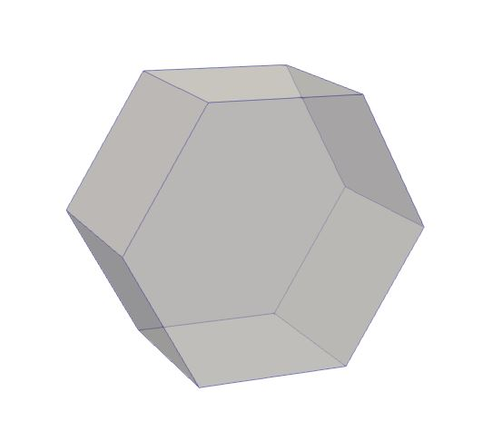
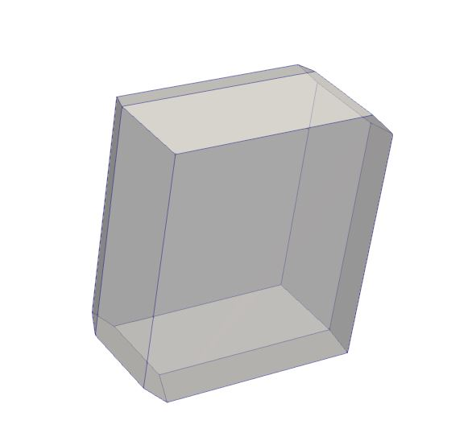
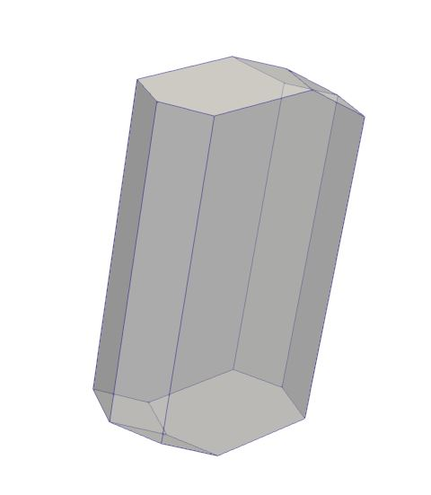
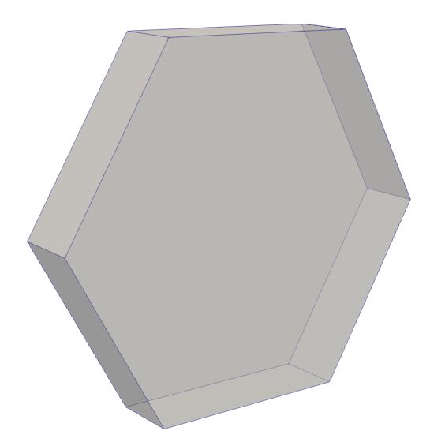
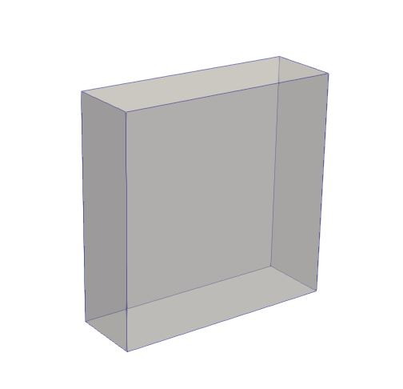
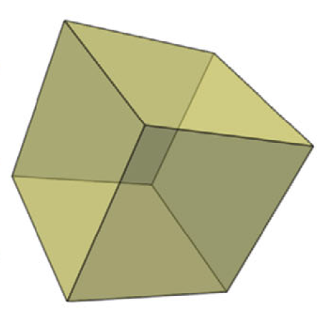
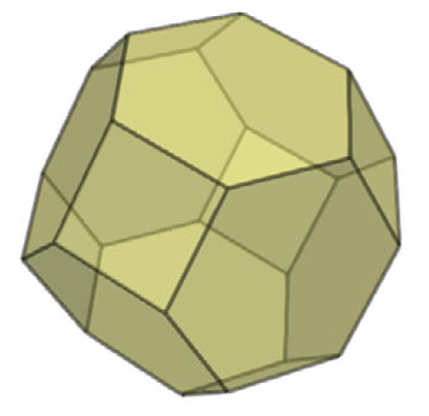
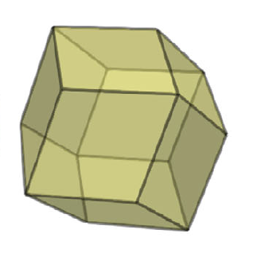

# Voronoi-based Lattice Distances
The repository contains the code of Voronoi-based Lattice Distances which encodes crystal lattices to Voronoi Domains and runs Voronoi-based metrics to compare them. 
The code is written in C++ and CMake. More details on the used metrics can be found in our paper published in the Crystal Research & Technology Journal: [Voronoi-Based Similarity Distances between Arbitrary Crystal Lattices](https://onlinelibrary.wiley.com/doi/10.1002/crat.201900197).

The project has been compiled and run only on Windows.

## Installation
### Download and install dependencies
1. Install [DOTNET 7.0](https://dotnet.microsoft.com/en-us/download/dotnet/7.0)
2. Install Visual Studio
3. The software and shared libraries below must be installed by the user:
    - [CMake-3.8](https://cmake.org/)
    - [boost_1_69_0](https://sourceforge.net/projects/boost/files/boost-binaries/1.69.0/)
    - [VTK-8.2.0](https://vtk.org/download/)
    - [zlib-1.2.11](https://www.zlib.net/)
    - [libxml2-2.7.8](https://github.com/zhigangc/libxml2-2.7.8)
4. Download the repository
5. Run the following to fetch `CGAL`, `Gemmi` and `Eigen` source code:
    ```
      cd VoronoiLatticeDistances/Install/windows-setup
      dotnet build
      dotnet run
    ```


### Set the environmental variables
To add the following details to your Windows environment go to: \
Control Panel -> System -> Advanced Settings -> Environmental variables

Create the following variables in the variables' environment:

- BOOST_ROOT: path_to\boost_1_69_0
- VTK_DIR: path_to\VTK-8.2.0\Install

### Add paths to the System `Path` variable

You also need to add the following directories with the required binaries to the `Path` variable:

- path_to\boost_1_69_0\lib32-msvc-14.1
- path_to\VTK-8.2.0\Install\bin
- path_to\zlib-1.2.11\bin
- path_to\libxml2-2.7.8.win32\bin
- path_to\VoronoiLatticeDistances\CGAL-4.14.3\auxiliary\gmp\lib

### Compile and install the repository

1. Open the cloned repository with CMake-GUI 
2. Generate the Visual Studio solution 
3. Open the solution file .sln with Visual Studio 
4. Choose `x86-Release` type from the top icon bar
5. In Build menu, build all the project
6. then from Build menu, Install the project

## Usage: Run the metric computations
To compute correctly the metrics, it is required that all input CIF files contain the primitive unit cell.
Running the executable 'voronoilatticedistances.exe' without parameters, it outputs the usage as follows: 

Required options: 

- -inputdir		[Input Folder with CIF files] 
- -outputdir	[Output Folder to write metric results] 

Output options (at least 1 required): 

- -vol   Outputs .csv file with Voronoi Cell volume 
- -vtp   Outputs .vtp files with Voronoi Cell of a Lattice (Paraview format file) 
- -csv   Outputs .csv files with Lattice and Voronoi Cell points 
- -off   Outputs .off files with Voronoi Cell vertices and faces 
- -ds    Outputs .csv file with Scale Invariant Distance matrix (n x n) between all n crystal lattices 
- -dh    Outputs .csv file with Extended Hausdorff Distance matrix (n x n) between all n crystal lattices 

Optional commands: 

- -intervals	[integer n (default n=2)]	It affects the number of rotation samples to be considered for metric computations (total number of rotations: 4*pi^2*n^3) 
- -threads		[integer t (default t=1)]	Rotation samples are divided among t threads

If users want to divide the voronoi cell computation from the metric computation, they can run 'voronoilatticedistances_off.exe' to compute only the metrics from OFF files.

Required options:

- -inputdir		[Input Folder with Voronoi Cell OFF files]
- -outputdir	[Output Folder to write metric results]

Output options (at least 1 required):

- -ds	Outputs .csv file with Scale Invariant Distance matrix (n x n) between all n crystal structures
- -dh	Outputs .csv file with Extended Hausdorff Distance matrix (n x n) between all n crystal structures

Optional commands:

- -intervals	[integer n (default n=2)]	It affects the number of rotation samples to be considered for metric computations (number of rotations: 4*pi^2*n^3)
- -threads		[integer t (default t=1)]	Rotation samples are divided among t threads

## Example of Voronoi Domains
There are following the Voronoi domains of 5 real crystal lattices from the T2 dataset used in our experiments: T2-epsilon, T2-delta, T2-beta, T2-gamma and T2-alpha. Plus, the voronoi domains of the standard cubic, body-centred cubic and face-centred cubic lattices.

<p float="left">
  
  
  
  
  
  
  
  
</p>


## Dendrogram and Heatmap
The dendrogram and the heatmap of the Voronoi-based metrics can be generated with the following script. The input csv file is generated by the options -dh or -ds of the previous executables.

```
RScript.exe .\Scripts\make_dendrogram_heatmap.R [csv file]
```
