# Voronoi-based Lattice Distances
Voronoi-based Lattice Distances encodes Crystal Lattices to Voronoi Domains and runs Voronoi-based metrics to quantify their Similarity. More details on the used metrics can be found in our paper published in the Crystal Research & Technology Journal: [Voronoi-Based Similarity Distances between Arbitrary Crystal Lattices](https://onlinelibrary.wiley.com/doi/10.1002/crat.201900197).

The project has been compiled and run only on `Windows x64`.

## Installation
1. Install Visual Studio (e.g. Community) choosing the following `single components`:
    - `.NET SDK`
    - `.NET 9.0 Runtime`
    - `MSVC v143 - C++ Build tools`
    - `C++/CLI for Build Tools`
    - `Windows SDK`
    - `CMake C++ Tools for Windows`
    - `Git for Windows`

2. Download the repository

2. Add the following environmental variables as User:
    - `VS_DIR`: Path to Visual Studio with all folders (e.g. `Microsoft Visual Studio\2022\Community`)

3. Run the following in a `Command Prompt` (no PowerShell) to install it:
    ```
      "%VS_DIR%\VC\Auxiliary\Build\vcvarsall.bat" x86_amd64
      cd VoronoiLatticeDistances/windows-setup
      dotnet build
      dotnet run install Release
    ```
4. Restart the command prompt and run the executables: `voronoilatticedistances.exe` or `voronoilatticedistances_off.exe`.

## Usage
To compute correctly the metrics, it is required that all input `CIF` files contain the `primitive unit cell`.
Run the executable without parameters for the usage. There are following some examples.
### Produce Voronoi-based metrics from CIF files on 5 threads
```
  .\voronoilatticedistances.exe -inputdir "path\to\cif_folder" -outputdir "path\to\output_dir" -ds -dh -threads 5
```
### Generate OFF files of Voronoi Domains and their volumes
```
  .\voronoilatticedistances.exe -inputdir "path\to\cif_folder" -outputdir "path\to\output_dir" -off -vol
```
### Generate Voronoi Domains for 3D visualization
File `.vtp` can be visualized with [Paraview software](https://www.paraview.org/).
```
  .\voronoilatticedistances.exe -inputdir "path\to\cif_folder" -outputdir "path\to\output_dir" -vtp
```
### Produce Voronoi-based metrics from OFF files
```
  .\voronoilatticedistances_off.exe -inputdir "path\to\off_folder" -outputdir "path\to\output_dir" -ds -dh 
```

Required options for `voronoilatticedistances.exe`: 

- `-inputdir`		[Input Folder with CIF files] 
- `-outputdir`	[Output Folder to write metric results] 

Output options (at least 1 required): 

- `-vol`   Outputs .csv file with Voronoi Cell volume 
- `-vtp`   Outputs .vtp files with Voronoi Cell of a Lattice (Paraview format file) 
- `-csv`   Outputs .csv files with Lattice and Voronoi Cell points 
- `-off`   Outputs .off files with Voronoi Cell vertices and faces 
- `-ds`    Outputs .csv file with Scale Invariant Distance matrix (n x n) between all n crystal lattices 
- `-dh`    Outputs .csv file with Extended Hausdorff Distance matrix (n x n) between all n crystal lattices 

Optional commands: 

- `-intervals`	[integer n (default n=2)]	It affects the number of rotation samples to be considered for metric computations (total number of rotations: 4*pi^2*n^3) 
- `-threads`		[integer t (default t=1)]	Rotation samples are divided among t threads
- `-debug`      Enable debug message logging
- `-verbose`    Enable more verbose message logging

## Example of Voronoi Domains
There are following the Voronoi domains of 5 experimental (or synthesized) crystal lattices from the `T2 dataset` used in our experiments: `T2-alpha`, `T2-beta`, `T2-gamma`, `T2-epsilon` and `T2-delta`. Plus, the Voronoi Domains of the `standard cubic`, `body-centred cubic` and `face-centred cubic` lattices. [Paraview software](https://www.paraview.org/) was used to visualise the output of `VoronoiLatticeDistances` executables:

<table align="center">
  <tr>
    <td align="center">
      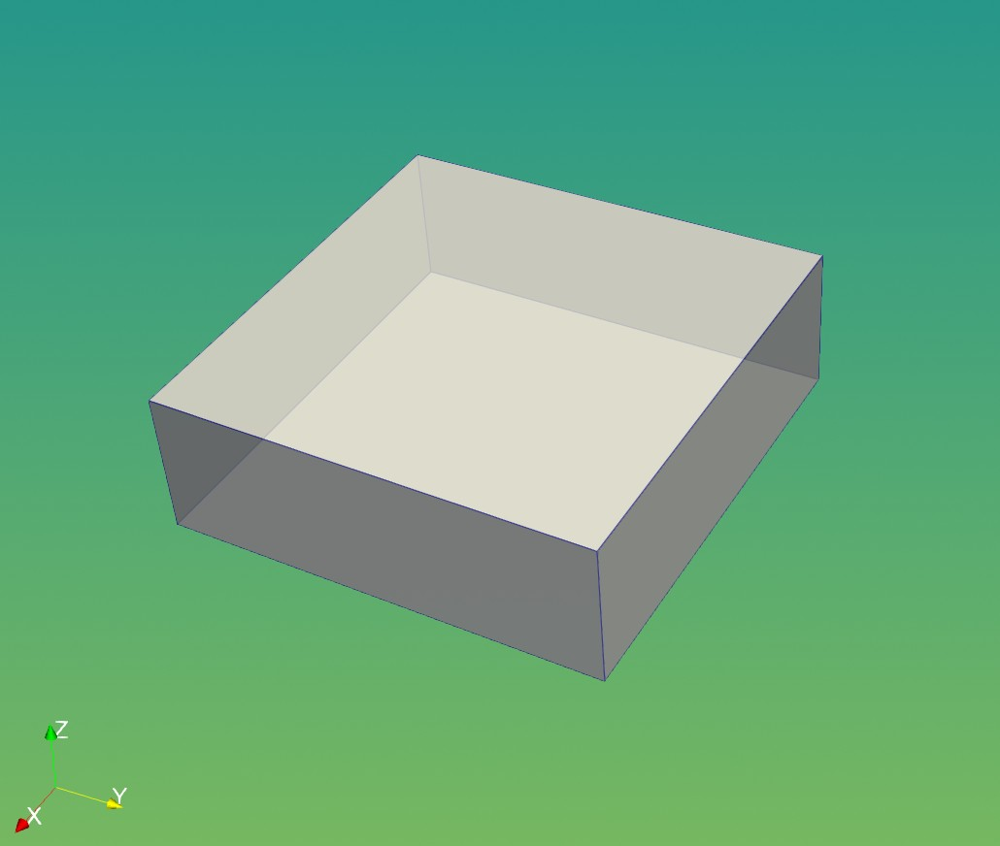
    </td>
    <td align="center">
      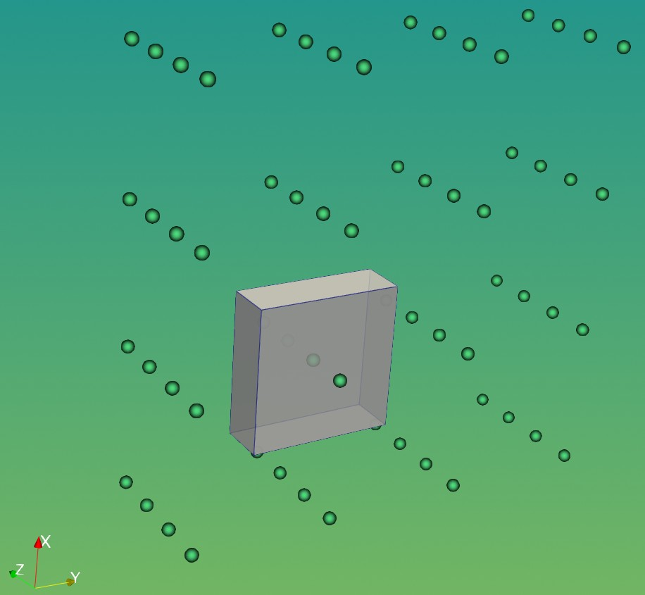
    </td>
  </tr>
  <tr>
    <td colspan="2" align="center">
      <em>Voronoi Domain computed within the T2-alpha lattice points of the 3x3x3 extended Niggli's Unit Cell.</em>
    </td>
  </tr>

  <tr>
    <td align="center">
      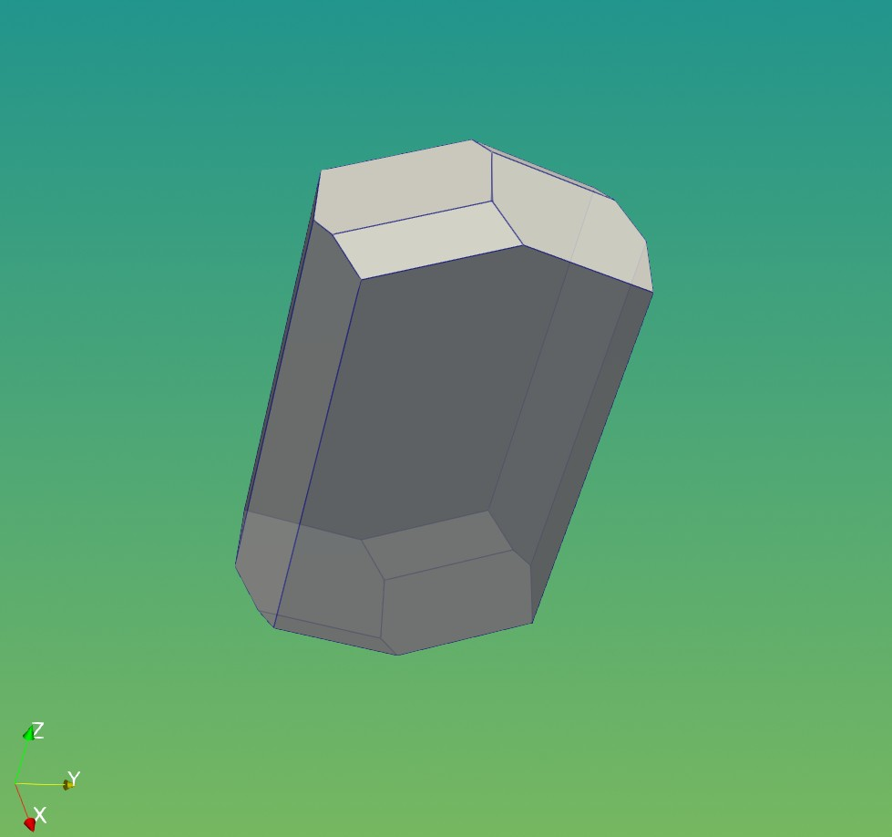
    </td>
    <td align="center">
      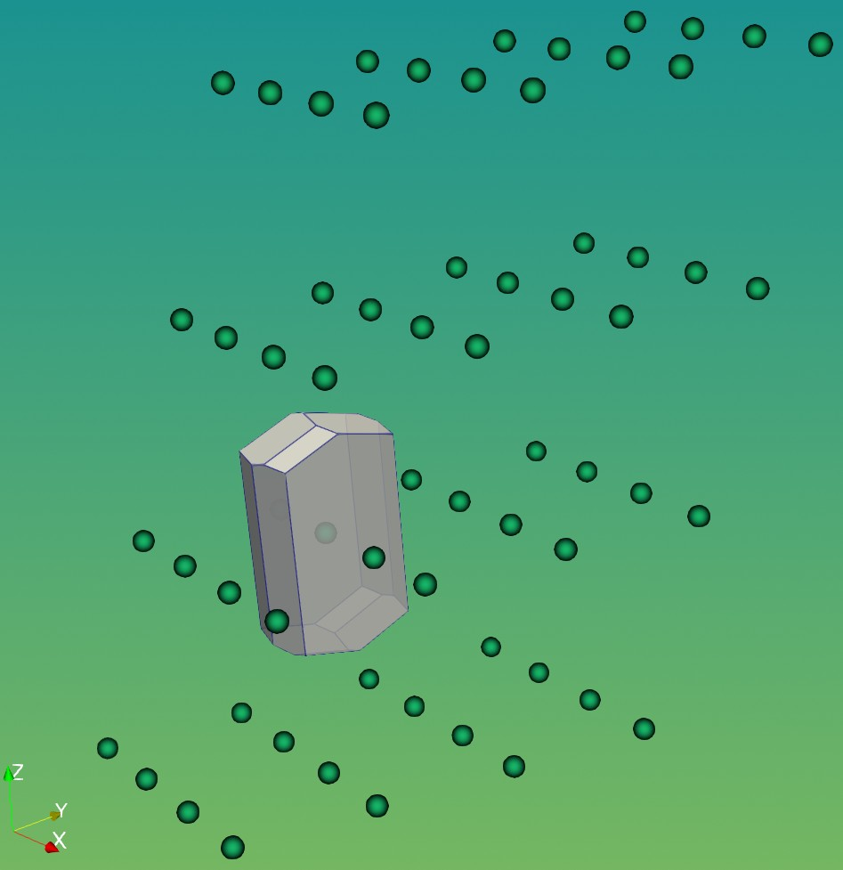
    </td>
  </tr>
  <tr>
    <td colspan="2" align="center">
      <em>Voronoi Domain computed within the T2-beta lattice points of the 3x3x3 extended Niggli's Unit Cell.</em>
    </td>
  </tr>

  <tr>
    <td align="center">
      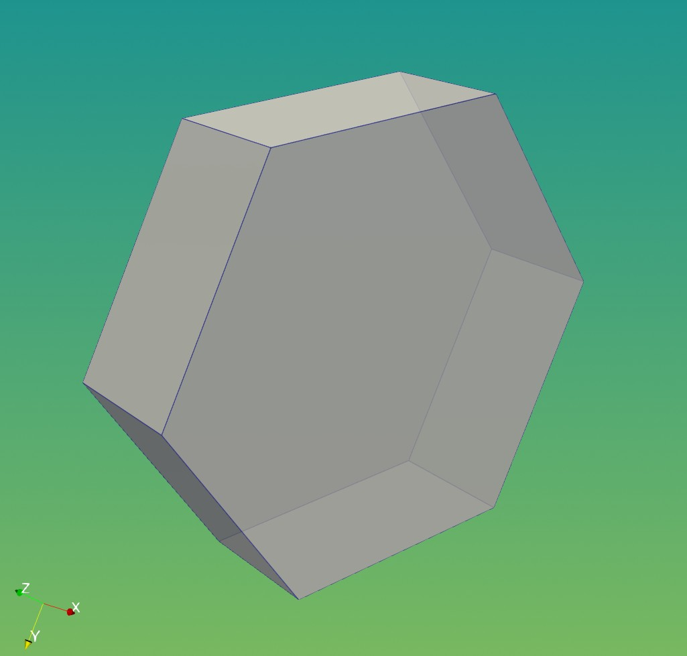
    </td>
    <td align="center">
      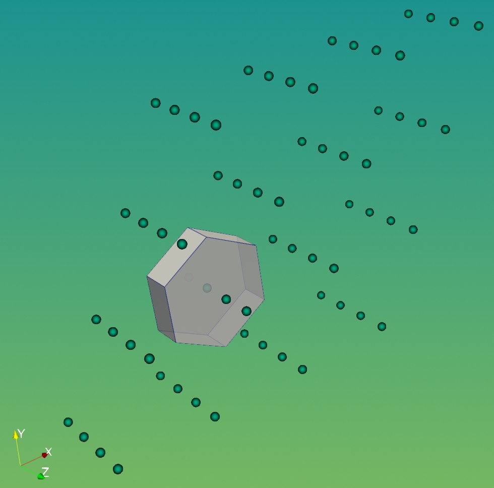
    </td>
  </tr>
  <tr>
    <td colspan="2" align="center">
      <em>Voronoi Domain computed within the T2-gamma lattice points of the 3x3x3 extended Niggli's Unit Cell.</em>
    </td>
  </tr>

  <tr>
    <td align="center">
      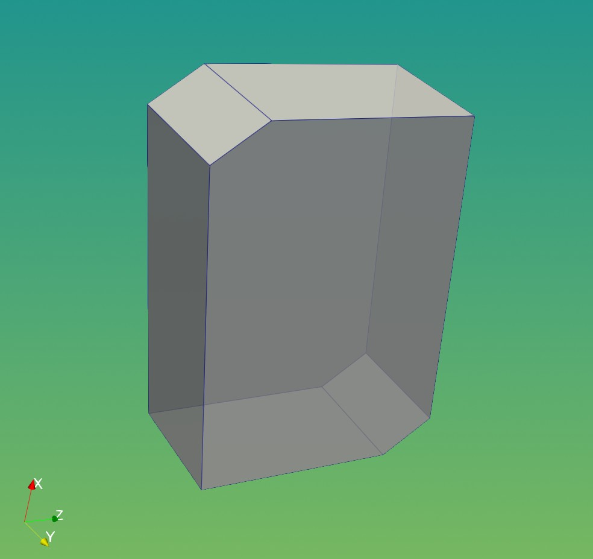
    </td>
    <td align="center">
      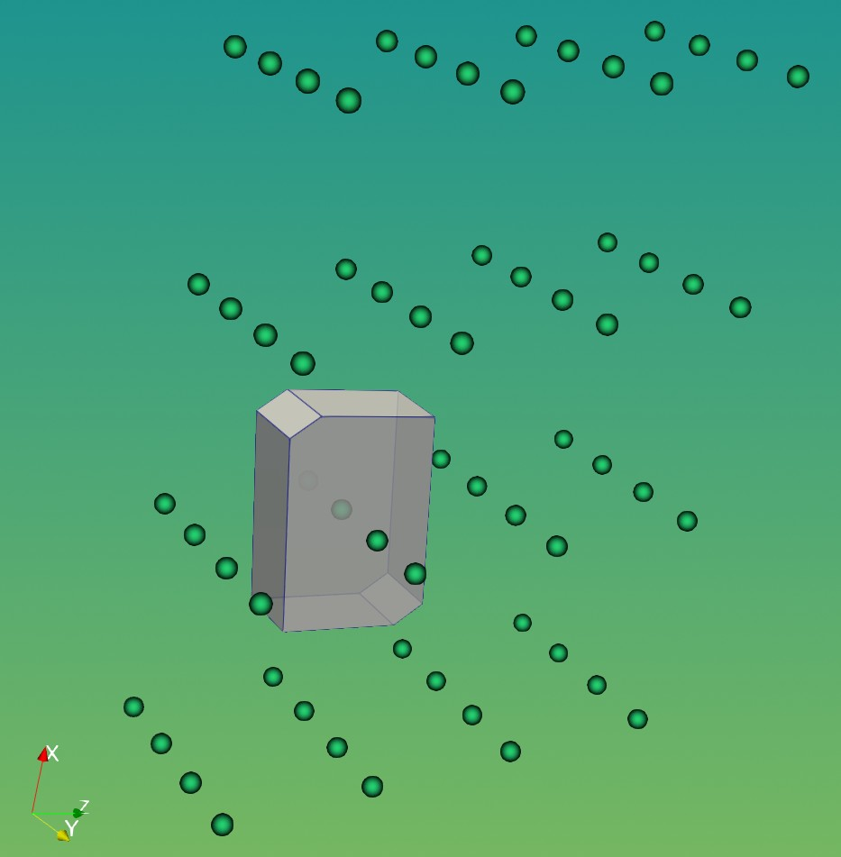
    </td>
  </tr>
  <tr>
    <td colspan="2" align="center">
      <em>Voronoi Domain computed within the T2-delta lattice points of the 3x3x3 extended Niggli's Unit Cell.</em>
    </td>
  </tr>

  <tr>
    <td align="center">
      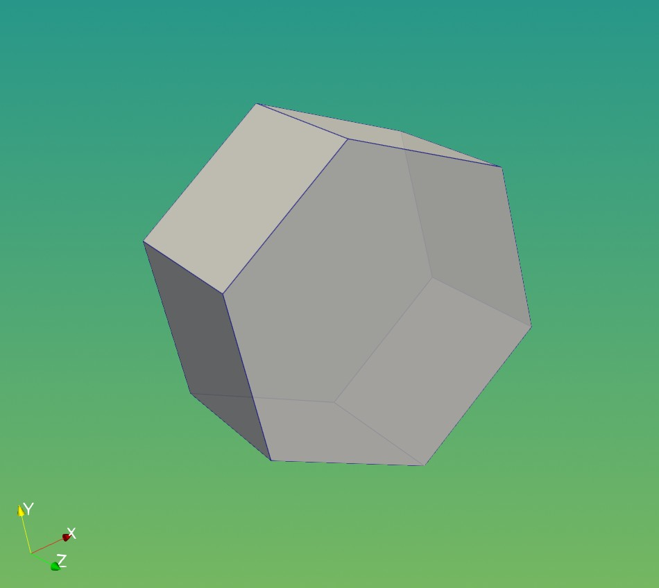
    </td>
    <td align="center">
      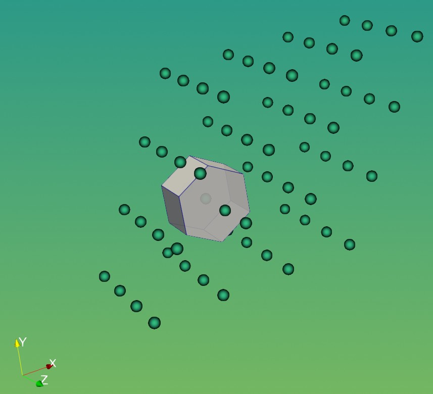
    </td>
  </tr>
  <tr>
    <td colspan="2" align="center">
      <em>Voronoi Domain computed within the T2-epsilon lattice points of the 3x3x3 extended Niggli's Unit Cell.</em>
    </td>
  </tr>
</table>

<table align="center">
  <tr>
    <td align="center">
      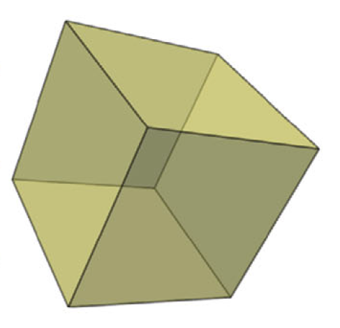
    </td>
    <td align="center">
      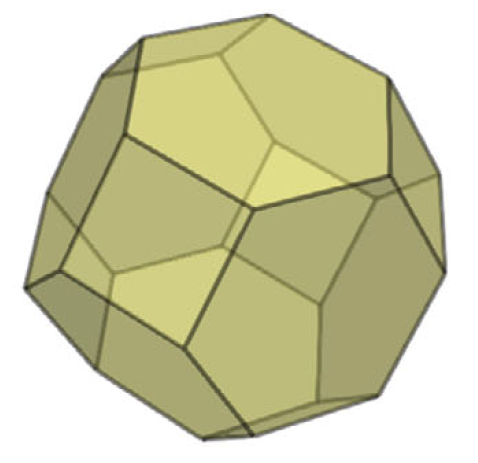
    </td>
    <td align="center">
      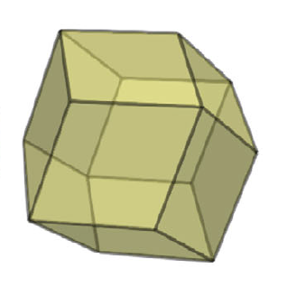
    </td>
    </tr>
    <tr>
      <td colspan="3" align="center">
        <em>Voronoi Domain computed within the standard cubic, body-centered cubic and face-centered cubic lattice points of the 3x3x3 extended Niggli's Unit Cell.</em>
      </td>
  </tr>
</table>

## Dendrogram and Heatmap
The dendrogram and the heatmap of the Voronoi-based metrics can be generated with the following script. The input csv file is generated by the options `-dh` or `-ds` of the previous executables.

```
RScript.exe .\Scripts\make_dendrogram_heatmap.R [csv file]
```

<table align="center">
  <tr>
    <td align="center">
      
    </td>
  </tr>
  <tr>
    <td colspan="1" align="center">
      <em>Heatmap and Dendogram of 109 crystal lattices from the T2 dataset that include the synthesized crystals plus their theoretical structures. The dendogram includes multiple synthesized structures since they were crystallized at different temperatures. The color gradient refers to the Extended Hausdorff Distance (or Rotationally Invariant Distance) where 'white' means the pair has the same lattice and 'black' means they are very different. </em>
    </td>
  </tr>
</table>


## Tests
You can install dependencies, project and run tests as follows
```
cd VoronoiLatticeDistances/windows-setup
dotnet run tests
```
...or 
```
dotnet run installdeps Debug
dotnet run install Debug
cd ../build
ctest --build-config Debug --build-target install --extra-verbose
```
